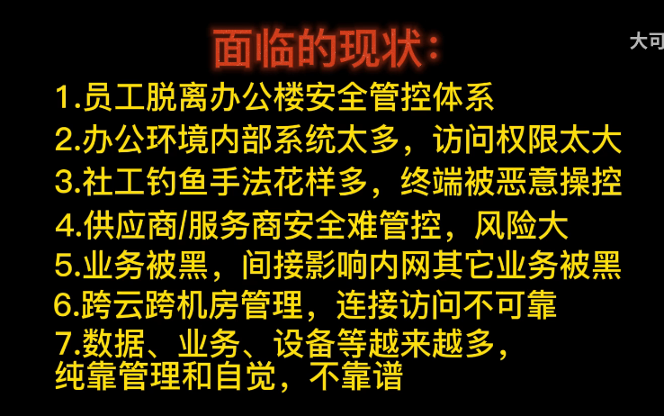
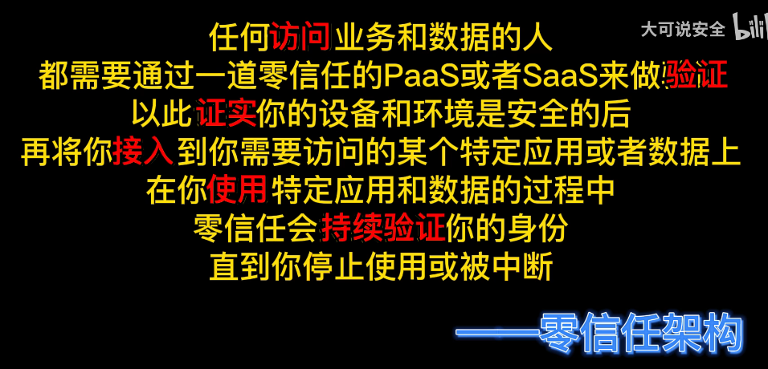
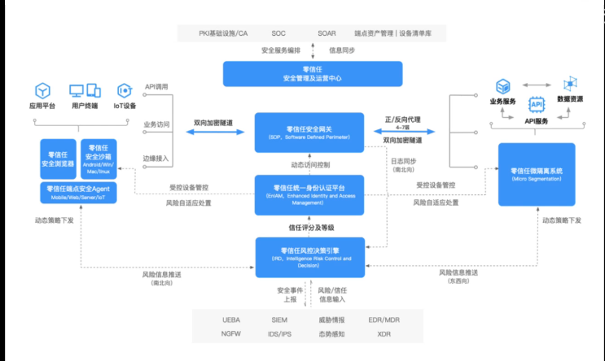
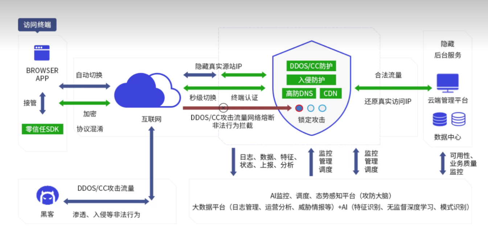
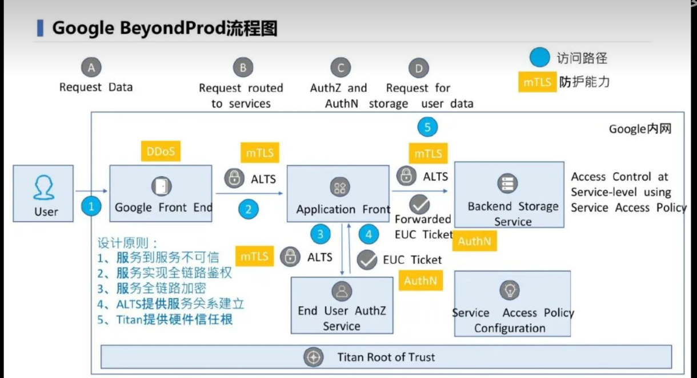

```
是一种理念 是一种思想

远程/内网 登陆账号->可以进行访问（权限大小不同）


```


## 应用层面

- 智能家居

  ```
  零信任系统
  ```


- 云原生（GOOGLE BeyondProd）

  ```
  各个 集群 节点
  master node1 node2
  ```

  

  

  

  可信验证模型

  

## 技术拓展层面

- 学历认证里面的零信任架构

- 机器学习提供更好的模型策略

### 问题



### 核心原则

- 验证每个访问来源

  ```
  用户 设备 应用
  ```

  设置权限矩阵->访问来源基线（账号密码安全状况etc）

- 验证每个访问请求

  ```
  有权 安全 应该 ->访问
  ```

  

- 动态的控制访问

```
智能判断终止连接 who how
```




### 关键点

1. 持续的验证
2. 限制风险范围
3. 自动化响应


### 市场基于SDP 软件定义边界





### GOOGLE BeyondProd流程图



### 动态信任模型

- 动态感知
- 动态授权
- KYC


